# Labo4 Perf & Valgrind  
yoann simonet  
  
## Établir une base line avec perf cpu-clock  
Pour avoir un point de comparaison et vérifier que perf ne fausse pas trop les mesures je commence par établir une mesure de référence (baseline).  
  
algorithme implémenté : bubble sort  
  
cmd utilisé `perf stat -e cpu-clock ./sort 1 2`  
  
- 1 = list ou array  
- 2 = 1000,10000 ou 100000  
  
### résultat pour array  
  
	nb valeurs 	|temps cpu [ms]  
	------------|--------------  
	1000 		| 1.81  
	10000 		| 147.67  
	100000 		| 17484.92  
  
### résultat pour liste  
  
	nb values 	|temps cpu [ms]  
	------------|--------------  
	1000 		| 1.97  
	10000 		| 156.49  
	100000 		| 19042.06  
  
**Remarque:**  
  
Pour les deux type de donné on remarque que le temps de traitement augmente de manière exponentielle par rapport au nombre de donné ce qui est tout a fait normale pour l' algorithme bubble sort.  
  
## Comparé la mesure baseline avec une mesure de perf  
Je mesure le nombre de page faulte cela va me permettre de mesuré l' impacte qu' a perf sur mon programme et d' avoir une première idée d'un des facteurs les plus pénalisant pour le programme.  
  
cmd utilisé: `sudo perf stat -e cpu-clock,faults ./sort 1 2`  
  
- 1 = list ou array  
- 2 = 1000,10000 ou 100000  
  
  
### résultat pour array  
  
	nb valeurs 	|temps cpu [ms] | faute de page | coup de la mesure  
	------------|---------------|---------------|------------------  
	1000 		| 1.86 			| 56 			| +2.6%  
	10000 		| 158.52 		| 72 			| +6%  
	100000 		| 17375.92 		| 248 			| -0,6%  
  
### résultat pour list  
  
	nb valeurs 	|temps cpu [ms] | faute de page | coup de la mesure  
	------------|---------------|---------------|------------------  
	1000 		| 1.90 			|59 			| -0,3%  
	10000 		| 165.49 		|131 			| +5%  
	100000 		| 19196.06 		|834 			| +0.8%  
**Remarque:**  
  
La mesure de page faulte n' impacte pas trop ( < 10%) le temps d' exécution du programme.  
  
on remarque aussi que bien que l' algorithme utilisant les listes fasse plus de page faulte (environ 4X pour 100000 valeurs) sont temps d' exécution n' est pas beaucoup plus long (seulement 1.1X pour 100000 valeurs) cela donne un première indice sur le fait que les page fault ne seront pas le point le plus important à optimisé dans un premier temps.  
  
  
## Trouver le hotspot du programme  
  
Je vais utilisé perf pour trouver la partie la plus problématique du programme.  
  
  
### Récolter des données  
  
cmd utilisé `sudo perf record ./sort 1 100000`  
  
- 1 = list ou array  
  
  
  
  
### résultat pour array  
  
cmd utilisé : `sudo perf report -f`  
  
la fonction la plus gourmande en temps de cpu est de loin:array_sort avec 99.5%  
  
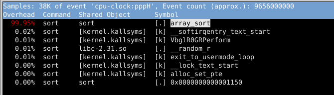  
  
On peu aller voir plus précisément dans cette fonction la partie qui pose problèmes  
en tapan `H` on trouve l' instruction la plus coûteuse  
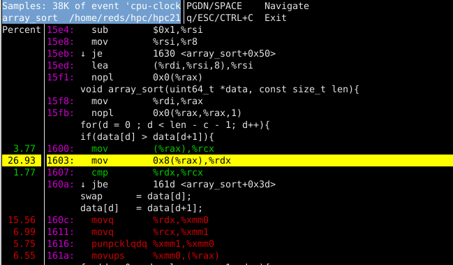  
  
On voir que les instructions les plus couteuse se trouve dan la deuxème boucle for ce qui n' est pas étonnant car c' est les instructions qui vont devoir étre appelé le plus souvant  
  
	void array_sort(uint64_t *data, const size_t len){  
		size_t c,d;  
		uint64_t swap;  
		for(c = 0 ; c < len - 1; c++){  
			for(d = 0 ; d < len - c - 1; d++){  
				if(data[d] > data[d+1]){  
					swap = data[d];  
					data[d] = data[d+1];  
					data[d+1] = swap;  
				}  
			}  
		}  
	}  
  
Mais on remarque aussi que seulement certaines de ces instructions occupe la majorité du temps.  
  
la boucle for en elle même 31%  
  
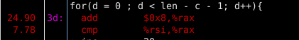  
  
celles du `if` qui occupe environ 30%  
  
  
  
celle utilisé pour le swap qui occupe environ 35%  
  
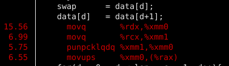  
  
il va donc falloir essayer de trouver pourquoi ces instruction en particulier sont plus long et comment les améliorer  
  
### résultat pour list  
  
cmd utilisé : `sudo perf report -f`  
  
la fonction la plus gourmande en temps de cpu est de loin list_sort avec 99.66%  
  
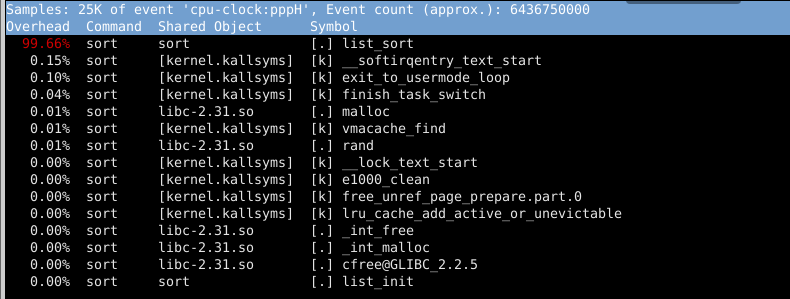  
  
On peu aller voir plus précisément dans cette fonction la partie qui pose problèmes  
en tapant `H` on trouve l' instruction la plus coûteuse  
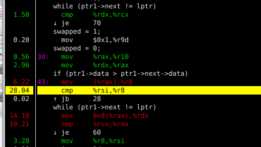  
  
On voir que les instructions les plus coûteuse se trouve dan la deuxième boucle while ce qui n' est pas étonnant car c' est les instructions qui vont devoir être appelé le plus souvent  
  
	while (ptr1->next != lptr)  
	{  
		if (ptr1->data > ptr1->next->data)  
		{  
			swap(ptr1, ptr1->next);  
			swapped = 1;  
		}  
		ptr1 = ptr1->next;  
	}  
  
Mais on remarque aussi que seulement certaines de ces instructions occupe la majorité du temps.  
  
la boucle while en elle même 25%  
  
  
  
celles du `if` qui occupe environ 34%  
  
  
  
celle utilisé pour le swap qui occupe environ 18%  
  
**remarque**  
  
on peut voir que normalement le swap est fait dans une fonction mais l' optimisation de gcc l' a mis directement dans le code de list_sort  
  
  
  
## Analyse des pages fault avec perf  
Pour finir comme expliqué au début du rapport je vais essayer de trouver l' origine des page fault (même si il ne sont pas trop coûteuse dans notre programme)  
  
cmd utilisé :`sudo perf record -e faults ./sort 1 100000`  
  
- 1 = list ou array  
  
### résultat pour array  
On voit que la plupart des cache miss on lieu dans la fonction d' init de nos données et la premier analyse faite avec perf ([voir](##Trouver le hotspot du programme)) nous a montrer que cette partie n' était absolument pas critique (représente moins d' 1% du temps d' exécution)  
  
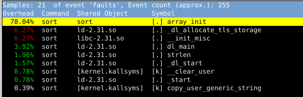  
  
  
### résultat pour list  
On voit que la plupart des cache miss on lieu dans la fonction malloc qui se trouve dans l' init de nos données et la premier analyse faite avec perf ([voir](##Trouver le hotspot du programme)) nous a montrer que cette partie n' était absolument pas critique (représente moins d' 1% du temps d' exécution).  
  
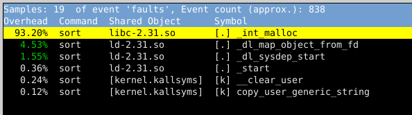  
  
## Aller plus en détaile dans l' analyse du code avec valgrind  
  
l' outils callgrind va permettre d' aller analyser plus en détaille les cache miss qui sont aussi un facteur extrêmement pénalisant pour le programme.  
  
  
cmd utilisé `sudo valgrind --tool=callgrind --simulate-cache=yes ./sort 1 10000`  
  
- 1 = list ou array  
  
  
### Analyse de array  
  
on peux voir que le taux de mis dans la cache de donnée D1 est de 4.1% que il n' y a presque pas de miss au niveau des autres caches  
  
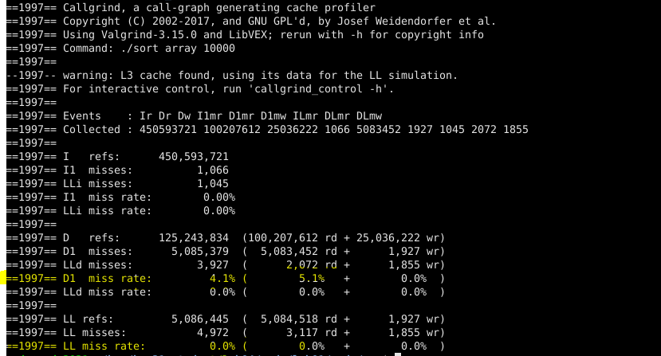  
  
Utilisation de kcachegrind pour visualiser les donnée récolté je met le filtre sur les miss de cache de donnée L1  
  
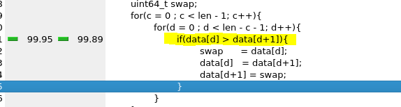  
  
on peux constater que la plupart de miss on lieu dans le if ce qui est normal car c' est le premier moment dans la boucle ou les donné vont être lu  
  
### Analyse de list  
  
on peux voir que le taux de mis dans la cache de donnée D1 est de 16.1% et notamment en lecture 24% mais comme pour les array les il y a très peut de miss au niveau des cache supérieur  
  
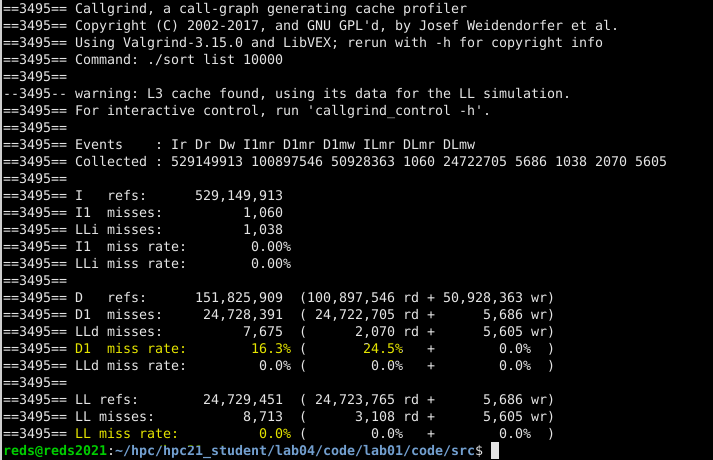  
  
Utilisation de kcachegrind pour visualiser les donnée récolté je met le filtre sur les miss de cache de donnée L1  
  
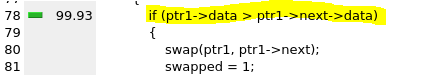  
  
on peux constater que la plupart de miss on lieu dans le if ce qui est normal car c' est le premier moment dans la boucle ou les donnés vont être lu  
  
## Améliorations possibles  
  
Suite a toutes les observation faites précédemment je vais présenter 4 angle d' attaque pour l' optimisation et expliqué si il sont valide ou non dans notre cas.  
  
### Avoir une meilleur localité des données  
Avoir une meilleur localité des données diminue les cache miss qui sont extrêmement coûteux.  
  
Mais dans notre cas l' accès au donnée (pour les arrays ou les listes) se fait de manier linaire dans la mémoire (en avançant dans les adresses) ce qui est exactement le bon paterne à adopté pour avoir le moins de caches miss possible **ce point ne pourra donc pas être amélioré**.  
  
### Diminué les page fault  
  
Les page fault sont eux aussi coûteux (bien plus que les cache miss) mais comme démontré au point précédant il ne sont absolument pas pénalisant dans notre programme.  
  
### Mieux paralléliser le programme  
  
La version du tris que j' ai implémenter n' est pas du-tout parallélisé car je n' utilise aucune thread.  
  
Après quelque recherche j ai pu constater que le bubble sort de par sont algorithme n' est malheureusement pas parallélisable.  
  
Il existe cependant d' autre algorithme de tris qui se prête mieux au multithreading exemple le tris par tas (source [ici](https://living-sun.com/fr/c/122804-fastest-multithreading-sorting-method-c-multithreading-sorting-time-mergesort.html))  
  
### Diminué le nombre d' opération  
  
Finalement après toutes ses constatation il semble que le bubble sort soit plus ou moins bloqué et ne puisse pas être beaucoup optimisé dans notre cas le meilleur moyen d' augmenter significativement la vitesse de tris est de changé d' algorithme pour passé a un algorithme  avec moins de complexité.  
  
le Tri par tas est particulièrement intéressant car il a un bonne complexité (nlog(n)) une bonne localité (1) est en plus il peut être multithreader par contre il ne fonctionne pas avec des listes.  
  
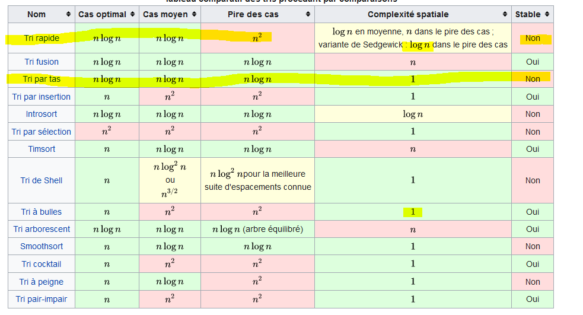
